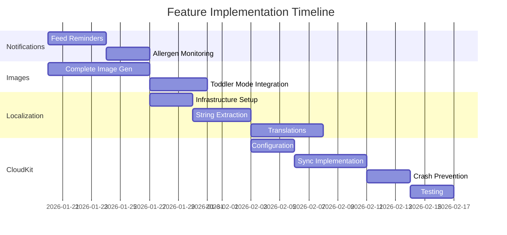
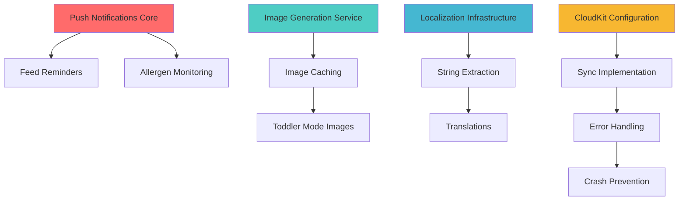

# Feature Implementation Roadmap

## Quick Reference

| Feature | Priority | Effort | Dependencies | Timeline |
|---------|----------|--------|--------------|----------|
| 👤 Account Creation (iCloudKit) | HIGH | Medium | CloudKit | Week 1 |
| ✅ 🏥 Pediatrician Summary | HIGH | Large | AI Service | Week 2-3 |
| ✅ Food Explorer Unchecking | MEDIUM | Small | None | Week 1 |
| 📸 Messy Face Gallery | MEDIUM | Medium | CloudKit | Week 2 |
| 🔔 Push Notifications (Feed) | HIGH | Medium | None | Week 1 |
| ⚠️ Allergen Monitoring Notifications | HIGH | Small | Notifications | Week 1 |
| 🖼️ Complete Image Generation | HIGH | Medium | None | Week 1-2 |
| ✅ 👶 Toddler Mode Images | MEDIUM | Small | Image Generation | Week 2 |
| 🌍 Translations/Localization | MEDIUM | Large | None | Week 2-3 |
| ☁️ CloudKit Integration | HIGH | Large | None | Week 3-4 |
| 📄 Daycare Report Ingestion | MEDIUM | Large | AI Service | Week 3-4 |

---

## Timeline Overview

---

## Feature Dependencies

---

## Phase 0: Core Account & User Experience (Week 1)

### Goals
- ✅ Implement iCloudKit-based account creation
- ✅ Add food unchecking capability in Explorer mode
- ✅ Begin Messy Face photo gallery foundation

### Deliverables

#### 0.1 Account Creation with iCloudKit
**Files to Create:**
- `Core/Models/UserAccount.swift` (~100 LOC)
- `Features/Onboarding/AccountCreationView.swift` (~250 LOC)
- `Core/Services/AccountManager.swift` (~200 LOC)

**Files to Modify:**
- `Features/Onboarding/OnboardingCoordinator.swift` - Add account creation step
- `Core/Services/CloudKitSyncManager.swift` - Link to user account

**Key Features:**
- [ ] iCloud account detection and validation
- [ ] User profile creation synced via CloudKit
- [ ] Graceful handling of no iCloud account
- [ ] Multi-device account sync
- [ ] Offline-first architecture

**Testing:**
- Test with iCloud signed in/out
- Multi-device sync verification
- Account recovery scenarios

---

#### 0.2 Food Explorer Unchecking
**Files to Modify:**
- `Core/Models/FoodLog.swift` - Add isMarkedAsTried property
- `Core/Managers/ToddlerManager.swift` - Add uncheck methods
- `Features/Toddler/FoodDetailView.swift` - Add uncheck UI
- `Features/Toddler/FoodExplorerView.swift` - Update progress tracking

**Key Features:**
- [ ] Swipe-to-uncheck gesture
- [ ] Confirmation dialog
- [ ] Update rainbow progress
- [ ] Undo functionality
- [ ] CloudKit sync for uncheck actions

**Testing:**
- Uncheck with allergen reactions
- Uncheck with multiple logs
- Progress tracking accuracy

---

#### 0.3 Messy Face Gallery Foundation
**Files to Create:**
- `Core/Models/MessyFacePhoto.swift` (~80 LOC)
- `Features/Gallery/MessyFaceGalleryView.swift` (~300 LOC)
- `Core/Services/PhotoStorageManager.swift` (~250 LOC)

**Files to Modify:**
- `Core/Managers/ToddlerManager.swift` - Link photos to food logs
- `Features/Toddler/FoodLoggingView.swift` - Add photo capture

**Key Features:**
- [ ] Photo capture during food logging
- [ ] Link photos to food items
- [ ] Local storage with SwiftData
- [ ] Basic gallery grid view
- [ ] Photo viewer

**Testing:**
- Capture multiple photos
- Photo-food association
- Storage limits

---

## Phase 1: Notifications & Image Foundation (Week 1)

### Goals
- ✅ Implement complete notification system
- ✅ Finish image generation with caching
- ✅ Resolve CloudKit crash issues (emergency fix)

### Deliverables

#### 1.1 Notification System
**Files to Create:**
- `Core/Services/NotificationManager.swift` (~300 LOC)
- `Features/Settings/NotificationSettingsView.swift` (~200 LOC)
- `Features/Toddler/AllergenMonitoringPrompt.swift` (~150 LOC)

**Files to Modify:**
- `Core/Managers/NewbornManager.swift` - Add notification scheduling
- `Features/Settings/SettingsView.swift` - Add notification settings link

**Key Features:**
- [x] Request notification permissions
- [x] Schedule feed reminders with customizable lead time
- [x] Allergen monitoring 2-hour check-ins
- [x] Notification action handlers
- [x] Settings UI

**Testing:**
- Unit tests for scheduling logic
- UI tests for permission flow
- Manual testing on device

---

#### 1.2 Image Generation Completion
**Files to Create:**
- `Core/Services/ImageCacheManager.swift` (~250 LOC)

**Files to Modify:**
- `Core/Services/ImageGenerationService.swift` - Add caching, batch generation
- `UI/Components/FoodImageView.swift` - Add loading states

**Key Features:**
- [x] Memory and disk caching
- [x] LRU cache eviction
- [x] Batch generation for common foods
- [x] Progress indicators
- [x] Improved error handling

**Testing:**
- Cache hit/miss scenarios
- API failure fallbacks
- Performance testing (50+ images)

---

#### 1.3 CloudKit Crash Fix (Emergency)
**Files to Modify:**
- `Core/Services/CloudKitSyncManager.swift` - Add defensive checks

**Critical Changes:**
- Validate CloudKit availability before ALL operations
- Prevent concurrent sync operations
- Add try-catch around all CloudKit calls
- Graceful degradation when unavailable

**Testing:**
- Reproduce crash scenario
- Test with CloudKit disabled
- Test with no iCloud account

---

## Phase 2: Toddler Mode & Localization Setup (Week 2)

### Goals
- ✅ Extend images to all toddler features
- ✅ Set up localization infrastructure
- ✅ Extract all hardcoded strings

### Deliverables

#### 2.1 Toddler Mode Images
**Files to Modify:**
- `Core/Managers/ToddlerManager.swift` - Image generation integration
- `UI/Components/FoodImageView.swift` - Toddler-specific styling
- `Features/Toddler/MealPlanningView.swift` - Show images
- `Features/Toddler/FoodTrackingView.swift` - Show images
- `Features/Toddler/RecipeDetailView.swift` - Recipe images

**Key Features:**
- [x] Playful image presentations
- [x] Larger touch targets
- [x] Animated loading states
- [x] Tap-to-enlarge functionality

---

#### 2.2 Localization Infrastructure
**Files to Create:**
- `Resources/en.lproj/Localizable.strings`
- `Resources/es.lproj/Localizable.strings`
- `Resources/fr.lproj/Localizable.strings`
- `Core/Services/LocalizationManager.swift` (~200 LOC)
- `Features/Settings/LanguageSettingsView.swift` (~150 LOC)

**Files to Modify:**
- ALL view files - Replace hardcoded strings

**Key Tasks:**
- [x] Configure Xcode project for localization
- [x] Create string catalogs
- [x] Extract ~500+ strings
- [x] Implement language switcher

---

#### 2.3 Pediatrician Summary Feature
**Files to Create:**
- `Core/Models/PediatricianSummary.swift` (~150 LOC)
- `Features/Health/PediatricianSummaryView.swift` (~400 LOC)
- `Features/Health/SummaryDetailView.swift` (~300 LOC)
- `Core/Services/DataAggregationService.swift` (~500 LOC)

**Files to Modify:**
- `Core/Services/GeminiService.swift` - Add summary generation prompts
- `Features/Settings/SettingsView.swift` - Add link to summaries

**Key Features:**
- [ ] Data aggregation for sleep, feeding, growth, medications, diapers
- [ ] AI-generated pediatric summaries
- [ ] Date range selection (between visits)
- [ ] Export to PDF for healthcare providers
- [ ] Visual charts and graphs
- [ ] Highlight unusual patterns or concerns

**Data Metrics:**
- Sleep: avg naps/day, avg duration, total sleep time
- Feeding: avg feeds/day, quantities, patterns
- Explorer: new foods tried, allergen reactions
- Medications: avg doses/day, medication names
- Diapers: avg changes/day, patterns
- Growth: height/weight changes

**Testing:**
- Generate summaries with sample data
- Verify AI summary quality
- Test PDF export
- Validate metric calculations

---

#### 2.4 Messy Face Gallery Enhancement
**Files to Modify:**
- `Features/Gallery/MessyFaceGalleryView.swift` - Add advanced features
- `Core/Services/PhotoStorageManager.swift` - Add CloudKit sync
- `Core/Services/CloudKitSyncManager.swift` - Support photo sync

**Key Features:**
- [ ] CloudKit photo sync with compression
- [ ] Advanced filtering (by child, date, food)
- [ ] Photo editing (crop, rotate, filters)
- [ ] Share to social media
- [ ] Create photo collages
- [ ] Export timeline with photos

**Testing:**
- Test with 100+ photos
- Verify CloudKit sync
- Test photo compression
- Validate storage limits

---

## Phase 3: Translations (Week 3)

### Goals
- ✅ Complete Spanish translations
- ✅ Complete French translations
- ✅ Localize food database

### Deliverables

#### 3.1 Spanish Translation
**Scope:**
- All UI strings
- Error messages
- Notification content
- Onboarding flow
- Food names (top 100)

**Quality Assurance:**
- Native speaker review
- Test all screens
- Verify formatting (dates, numbers)

---

#### 3.2 French Translation
**Scope:**
- Same as Spanish

**Quality Assurance:**
- Native speaker review
- Test all screens
- Verify formatting

---

#### 3.3 Food Database Localization
**Files to Create:**
- `Core/Data/FoodDatabase+Localization.swift`

**Data:**
- Spanish names for 200+ foods
- French names for 200+ foods
- Localized allergen information
- Localized serving suggestions

---

## Phase 4: CloudKit Production (Week 4)

### Goals
- ✅ Complete CloudKit integration
- ✅ Implement robust error handling
- ✅ Comprehensive testing
- ✅ Zero crashes

### Deliverables

#### 4.1 CloudKit Configuration
**Tasks:**
- [x] Configure CloudKit container in Apple Developer
- [x] Define CloudKit schema (record types)
- [x] Update entitlements
- [x] Test development environment

---

#### 4.2 Sync Implementation
**Files to Create:**
- `Core/Services/CloudKitRecordMapper.swift` (~400 LOC)
- `Features/Settings/CloudKitSyncView.swift` (~250 LOC)

**Files to Modify:**
- `Core/Services/CloudKitSyncManager.swift` - Complete implementation

**Key Features:**
- [x] Bidirectional sync (upload/download)
- [x] Conflict resolution
- [x] Change tracking
- [x] Quota management
- [x] Sync UI with status

---

#### 4.3 Error Handling & Crash Prevention
**Critical Implementations:**
- [x] Network error recovery
- [x] Quota exceeded handling
- [x] Account status validation
- [x] Concurrent operation prevention
- [x] Retry logic with exponential backoff

**Testing:**
- Stress testing (1000+ records)
- Network failure scenarios
- Quota limit testing
- Multi-device sync
- **Crash scenario reproduction**

---

---

## Phase 5: Daycare Integration (Week 3-4)

### Goals
- ✅ Upload and parse daycare reports (PDF/Image)
- ✅ Intelligent event mapping to logs
- ✅ Review flow for parents

### Deliverables

#### 5.1 Report Parser Service
**Files to Create:**
- `Core/Services/DaycareReportParser.swift`
- `Core/Services/OCRService.swift`

**Key Features:**
- [ ] Text recognition (Vision framework) for images/PDFs
- [ ] Layout analysis for different report formats
- [ ] Generic file support (.txt, .csv, .json)
- [ ] Gemini integration for unstructured text/files
- [ ] Event extraction (Nap, Feed, Diaper)

#### 5.2 Report Review UI
**Files to Create:**
- `Features/Daycare/ReportUploadView.swift`
- `Features/Daycare/ReportReviewView.swift`

**Key Features:**
- [ ] Document scanner integration
- [ ] File picker for text/data files
- [ ] Parsed event list
- [ ] Conflict resolution (if overlapping logs)
- [ ] "Add to Log" confirmation

---

## Testing Strategy

### Unit Tests (Target: 90% coverage for new code)
- `NotificationManagerTests.swift`
- `ImageGenerationServiceTests.swift`
- `ImageCacheManagerTests.swift`
- `CloudKitSyncManagerTests.swift`
- `CloudKitRecordMapperTests.swift`
- `LocalizationManagerTests.swift`

### Integration Tests
- End-to-end notification delivery
- Image generation → caching → display
- CloudKit sync across devices
- Language switching with data persistence

### UI Tests
- Notification permission flow
- Allergen monitoring prompt
- Image loading states
- Language selection
- CloudKit sync UI

### Manual Testing Checklist
- [ ] Grant notification permissions → schedule feed reminder → verify delivery
- [ ] Deny notification permissions → verify graceful handling
- [ ] Log high-risk allergen → verify prompt appears → set 2hr reminder
- [ ] Generate 20 images → verify caching → restart app → verify instant load
- [ ] Switch to Spanish → verify all screens translated
- [ ] Switch to French → verify all screens translated
- [ ] Enable CloudKit sync → log data on Device A → verify appears on Device B
- [ ] Test CloudKit offline → verify queuing → go online → verify sync
- [ ] **Reproduce tonight's crash → verify fix**
- [ ] Test with no iCloud account → verify graceful degradation

---

## Risk Assessment

### High Risk 🔴
| Risk | Impact | Mitigation |
|------|--------|------------|
| CloudKit crashes in production | App unusable | Extensive testing, defensive programming, feature flag |
| Image API costs exceed budget | Financial | Aggressive caching, daily limits, monitoring |
| Translation errors confuse users | Poor UX | Native speaker review, user testing |

### Medium Risk 🟡
| Risk | Impact | Mitigation |
|------|--------|------------|
| Notification permission denial | Reduced engagement | Clear explanation, in-app alternatives |
| CloudKit quota limits | Sync failures | Monitor usage, alert users, optimize data |
| Image generation slow | Poor UX | Progress indicators, background generation |

### Low Risk 🟢
| Risk | Impact | Mitigation |
|------|--------|------------|
| Cache eviction too aggressive | More API calls | Tune cache size, monitor hit rate |
| Localization missing strings | Fallback to English | Automated tests for coverage |

---

## Success Criteria

### Phase 1 Complete When:
- ✅ Feed reminders deliver on time 95%+ of the time
- ✅ Allergen monitoring prompt appears for all high-risk foods
- ✅ Image cache hit rate >90% after initial load
- ✅ Zero CloudKit-related crashes in testing

### Phase 2 Complete When:
- ✅ All toddler screens display food images
- ✅ All hardcoded strings extracted to Localizable.strings
- ✅ Language switcher functional

### Phase 3 Complete When:
- ✅ 100% string coverage in Spanish and French
- ✅ Native speaker approval
- ✅ All screens tested in each language

### Phase 4 Complete When:
- ✅ CloudKit sync works across 2+ devices
- ✅ 99%+ sync success rate in testing
- ✅ Zero crashes in 100+ test syncs
- ✅ Conflict resolution tested and working

---

## Post-Implementation Monitoring

### Week 1 After Release:
- Monitor CloudKit crash reports (target: 0)
- Track notification delivery rates
- Monitor image generation API costs
- Collect user feedback on translations

### Week 2-4 After Release:
- Analyze notification engagement rates
- Optimize image cache based on usage patterns
- Expand translations if demand exists
- Fine-tune CloudKit sync frequency

---

## Next Steps

1. **Review this roadmap** - Confirm priorities and timeline
2. **Approve implementation plan** - Review technical approach
3. **Begin Phase 1** - Start with notifications and image completion
4. **Set up CloudKit container** - Requires Apple Developer access
5. **Arrange translation services** - Find native Spanish/French speakers

---

## Questions for User

1. **CloudKit Priority:** Should we prioritize fixing the crash first (emergency patch) or implement the full solution?
2. **Translation Budget:** Do you have budget for professional translation services, or should we use community/AI translation?
3. **Notification Defaults:** What should be the default lead time for feed reminders? (Recommend 30 minutes)
4. **Image Generation Limits:** What's your monthly budget for Google Imagen API? (Recommend setting a $50/month limit initially)
5. **Timeline Flexibility:** Is the 4-week timeline acceptable, or do you need certain features sooner?
